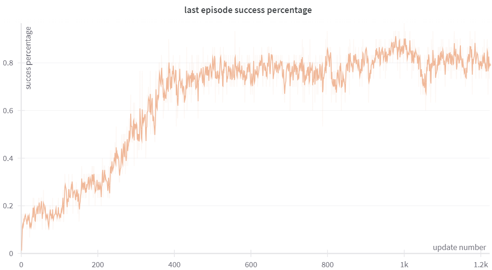

# RL2-implementation-pytorch
This is an implementation of the algorithmic idea presented in ''Rl2: Fast reinforcement learning via slow reinforcement learning”([Duan. 2016](https://arxiv.org/abs/1611.02779))  and ''Learning to reinforcement learn'' ([Wang. 2016](https://arxiv.org/abs/1611.05763)) in pytorch. The implementation applies it to the [Meta World](https://github.com/Farama-Foundation/Metaworld) benchmark.

### SOME NOTES:

An important goal of this implementation is for it to be easy to understand. With that intention in mind, it is highly commented.

It is implemented for the Meta World benchmarks but it should be easy to adapt it to other gymnasium benchmarks. To do this aaptation the tasks initialization, the tasks sampler, the reward normalization and the end of episode handling should be modified.

The code contains non crucial components like logging with weights and biases, reward normalization and simple model saving.

Multiprocessing for parallel environment execution is achieved through Ray.

#### Example run:
Finally, a training run is shown on the Meta World ML10 benchmark. It attains a similar performance to that given in "Meta-World: A Benchmark and Evaluation for Multi-Task and Meta Reinforcement Learning".

